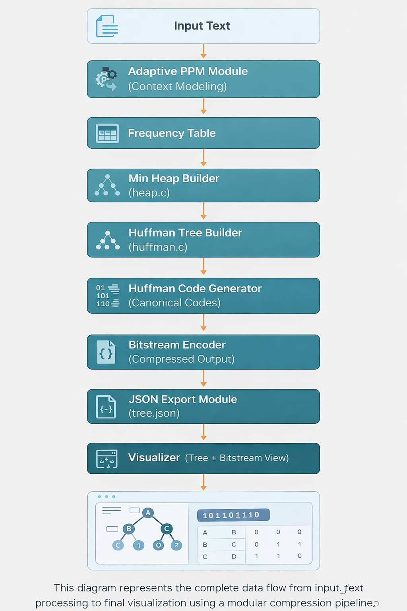

# 🚀 Adaptive Context-Based Huffman Compression

### 🌲 With Visual Huffman Tree Simulation

An advanced **end-to-end lossless compression system** that combines **adaptive context modeling (PPM-inspired)** with **Huffman coding**, along with an **interactive visualization engine** to simulate tree construction and encoding.

---

## 🌟 Overview

This project goes beyond traditional Huffman coding by introducing:

* 📊 **Dynamic context-based frequency updates**
* 🌲 **Real-time Huffman tree construction**
* 🔑 **Canonical code generation**
* 📤 **JSON-based visualization pipeline**
* 🌐 **Interactive frontend visualizer**

> 💡 Designed as a **complete compression pipeline**, not just an algorithm implementation.

---

## 🏗️ Architecture Diagram



> Represents full pipeline from input processing to visualization.

---

## 🔄 Project Flow

```
Input Text
⬇
Adaptive Context Modeling (PPM)
⬇
Frequency Update
⬇
Huffman Tree Construction (Min Heap)
⬇
Canonical Code Generation
⬇
Bitstream Encoding
⬇
JSON Export
⬇
HTML Visualizer (Tree + Bitstream)
```

---

## 📁 Project Structure

```
Adaptive-Huffman-Compression/
│
├── src/                 # Core logic (C)
│   ├── main.c
│   ├── adaptive.c
│   ├── heap.c
│   ├── huffman.c
│
├── include/             # Header files
│   ├── adaptive.h
│   ├── heap.h
│   ├── huffman.h
│
├── visualizer/          # Frontend visualization
│   ├── visualizer.html
│   ├── tree.json
│
├── docs/                # Diagrams
│   └── architecture.png
│
├── README.md
├── Makefile
├── .gitignore
```

---

## ⚙️ How It Works

### 1. 📥 Input Processing

Reads input text and initializes pipeline.

### 2. 🧠 Adaptive Context Modeling

Updates symbol frequencies dynamically using context-based logic.

### 3. 🌲 Huffman Tree Construction

* Uses **Min Heap (priority queue)**
* Builds optimal prefix tree

### 4. 🔑 Code Generation

Generates **canonical Huffman codes** for efficiency.

### 5. 🔢 Encoding

Transforms input into compressed **bitstream**.

### 6. 📤 JSON Export

Exports:

* Tree structure
* Encoding steps
  → `tree.json`

### 7. 🌐 Visualization

HTML interface displays:

* Huffman tree 🌲
* Bitstream 🔢
* Step-by-step simulation ⚙️

---

## 🖥️ How to Run

### 🔧 Compile

```bash
gcc src/main.c src/adaptive.c src/heap.c src/huffman.c -o huffman
```

### ▶️ Run

```bash
./huffman
```

---

## 🌐 Visualizer

Open in browser:

```
visualizer/visualizer.html
```

> Uses `tree.json` generated by the program.

---

## 🧪 Sample Output

| Input          | Output               |
| -------------- | -------------------- |
| `example text` | Compressed bitstream |

✔ Visualization shows full encoding process

---

## 🚀 Why This Project Stands Out

✅ Not just Huffman — **Adaptive Compression System**
✅ Combines:

* Data Structures (Heap, Tree)
* Algorithms (Greedy, Encoding)
* Systems Design (Pipeline)
* Frontend Visualization

✅ Demonstrates real-world concepts used in:

* File compression systems
* Streaming encoders
* Data transmission

---

## 📈 Future Enhancements

* 🔓 Decompression module
* 📊 Compression ratio analysis
* ⚡ Real-time visualization
* 🖥️ GUI interface
* 📁 File-based compression

---

## 🛠️ Tech Stack

* **C** → Core compression engine
* **HTML + JavaScript** → Visualization
* **JSON** → Data exchange

---

## 📌 Key Learning Outcomes

* Huffman Coding & Greedy Algorithms
* Priority Queue (Min Heap) Implementation
* Tree Data Structures
* File Handling in C
* System Pipeline Design
* Frontend + Backend Integration

---

## 🤝 Contribution

Contributions are welcome!
Feel free to fork, improve, and submit pull requests.

---

## 📜 License

This project is open-source and available under the MIT License.

---

# ⭐ If you like this project, give it a star!

---

## Tagline

> Built an **Adaptive Context-Based Huffman Compression System** with real-time visualization, demonstrating strong skills in data structures, algorithms, and system design.
